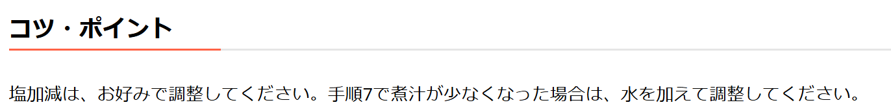

# 画面仕様

このドキュメントでは、本アプリの各画面の仕様を説明します。

## 📌 目次
- [画面仕様](#画面仕様)
  - [📌 目次](#-目次)
  - [共通要素](#共通要素)
  - [1. トップページ](#1-トップページ)
  - [2. レシピ一覧ページ](#2-レシピ一覧ページ)
  - [3. レシピ詳細ページ](#3-レシピ詳細ページ)
  - [4. レシピ追加ページ](#4-レシピ追加ページ)
  - [5. レシピ編集ページ](#5-レシピ編集ページ)

 

## 共通要素
アプリの各ページで共通して使用される要素を説明します。

### ヘッダー

- 画面上部に固定表示される共通ヘッダー
- タイトルをクリックするとトップページに遷移

### 画面上部へスクロールするボタン

- 画面下部に表示され、押下するとページの先頭へスクロールします。

[🔼 目次へ戻る](#📌-目次)

## 1. トップページ
このページでは、レシピ管理アプリのトップ画面を表示します。  
ユーザーはカテゴリを選択してレシピ一覧に移動できます。
### 画面全体図

### 構成要素
- **カテゴリ一覧**

  - 各カテゴリのボタンをクリックすると、対応するレシピ一覧ページに遷移
    -  "お肉" ボタン → `Beef Recipes` 画面へ
    -  "お魚" ボタン → `Fish Recipes` 画面へ
    -  "お野菜 ボタン → `Vegetable Recipes` 画面へ
    -  "スープ" ボタン → `Soup Recipes` 画面へ
  

[🔼 目次へ戻る](#📌-目次)

## 2. レシピ一覧ページ
各カテゴリ（魚、肉、野菜、スープ）のレシピを一覧表示するページです。  

### 画面全体図
#### お魚レシピ一覧  
 

#### お肉レシピ一覧

#### 野菜レシピ一覧  
  

#### スープレシピ一覧  

### カテゴリ別の違い
画面の構成は同じですが、表示されるレシピがカテゴリごとに異なります。
- **魚カテゴリ**: 魚料理のレシピが一覧表示されます。
- **肉カテゴリ**: 肉料理のレシピが一覧表示されます。
- **野菜カテゴリ**: 野菜を使った料理のレシピが一覧表示されます。
- **スープカテゴリ**: スープ料理のレシピが一覧表示されます。

### 構成要素
- **レシピ一覧**  
    
  - 各レシピがカード形式で表示される  
  - カードをクリックすると、レシピ詳細ページへ遷移
- **レシピ追加ボタン**
  
  - ボタンをクリックすると、レシピ追加ページへ遷移
  - 新しいレシピを登録する際に使用

## 3. レシピ詳細ページ
このページでは、選択したレシピの詳細情報を表示します。  
編集や削除の操作が可能です。  
### 画面全体図

### 構成要素
- **レシピタイトル**
  
  - レシピ名を表示
- **レシピ動画**
  
  - レシピ動画を表示
- **材料リスト**
  
  - 各材料とその分量を表示
- **作り方**
  
  - ステップごとに作り方を表示
- **コツ・ポイント**
  
  - レシピのコツ・ポイントを表示
- **アクションボタン**
  
  - クリックすると `Edit` と `Delete` の選択肢が表示されます。
  - `Edit` をクリックすると **編集ダイアログ** が表示されます。
  - `Delete` をクリックすると **削除ダイアログ** が表示されます。

[🔼 目次へ戻る](#📌-目次)

## 4. レシピ追加ページ
このページでは、新しいレシピを登録できます。  
ユーザーは、レシピ名、カテゴリ、材料、作り方、レシピ動画URL、画像などを入力し、レシピを保存できます。

## 5. レシピ編集ページ